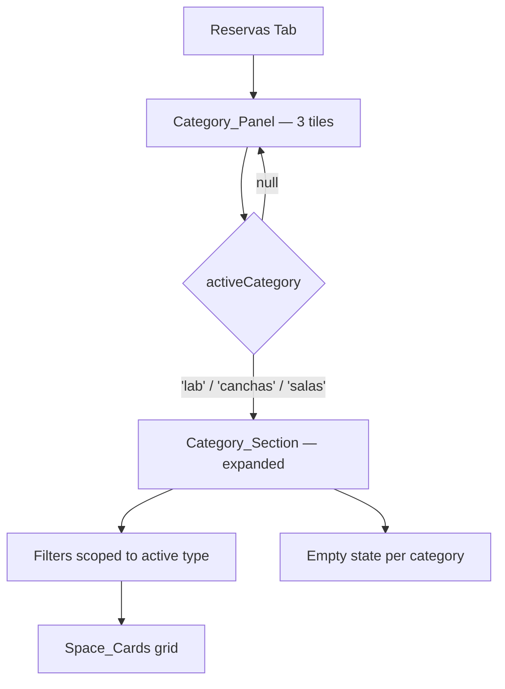
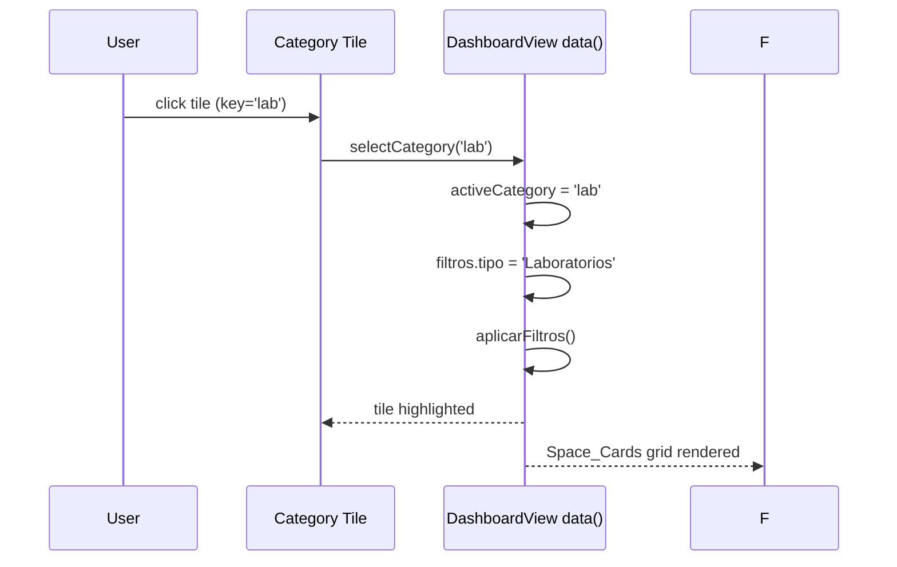
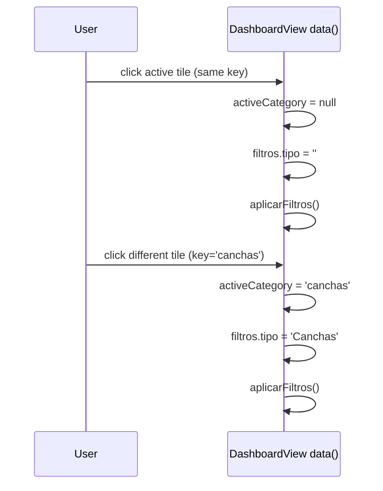
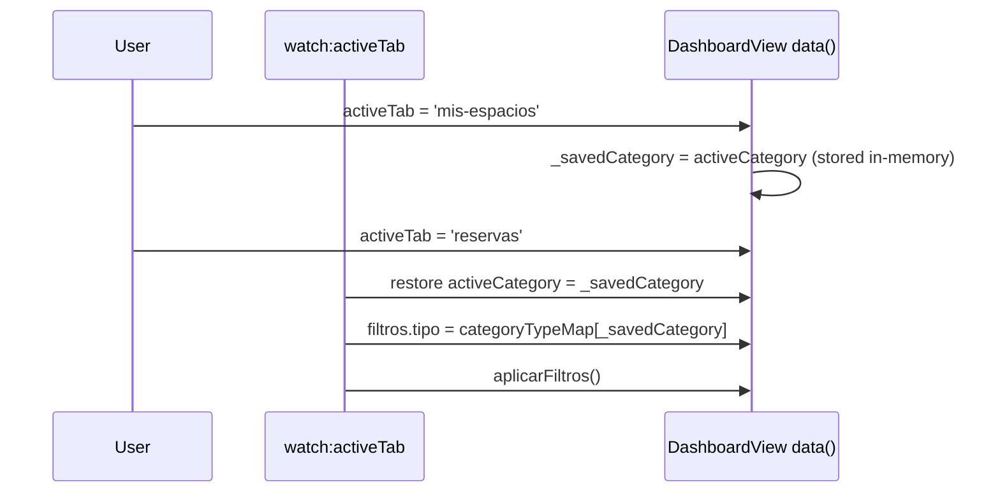

# Design Document: space-reservation-categories

## Overview

This feature replaces the flat category-grouped space list in the "Reservar Espacios" tab with an interactive Category_Panel: three clickable tiles (Laboratorios, Salas de Auditorio, Canchas) that expand to show filtered Space_Cards for that category. All changes are self-contained within `DashboardView.vue` (Vue 2 Options API, Tailwind CSS); no new components are introduced.

When no category is active the panel shows all three tiles. Clicking a tile sets it as the active category, filters the space list to that type, locks the `tipo` filter, and persists the selection in-memory for the session. Clicking the same tile again collapses it back to the all-tiles view.

---

## Architecture



---

## Sequence Diagrams

### Expand a Category



### Collapse / Switch Category



### Tab switch — session persistence



---

## Components and Interfaces

### Category_Panel (inline in DashboardView template)

Rendered as a `<div>` grid of three `<button>` elements. Replaces the current `<template v-else>` results block.

**Tile data shape** (produced by `categoriasPanel` computed):

```javascript
// CategoryTile
{
  key: String,          // 'lab' | 'canchas' | 'salas'
  label: String,        // 'Laboratorios' | 'Salas de Auditorio' | 'Canchas'
  icon: String,         // Lucide icon name used in :is binding
  backendTipo: String,  // 'Laboratorios' | 'Salas' | 'Canchas'
  count: Number,        // spaces.filter(s => s.tipo === backendTipo).length
  availableCount: Number // spaces.filter(s => s.tipo === backendTipo && s.disponible).length
}
```

**Responsibilities:**
- Render icon, label, total count badge, and available-count sub-label
- Apply active highlight when `activeCategory === tile.key`
- Disable all tiles (greyed, pointer-events-none) when `spacesError` is set
- Show stale count notice in error state instead of live counts

### Category_Section (inline in DashboardView template)

Rendered below the Category_Panel when `activeCategory !== null`.

**Responsibilities:**
- Show back-to-categories affordance (chevron or label)
- Pass `espaciosCategoriaActiva` (computed) into the Space_Cards grid
- Show empty-state message when `espaciosCategoriaActiva.length === 0`
- Show the locked `tipo` badge instead of the editable tipo select

---

## Data Models

### New reactive state (additions to `data()`)

```javascript
// In data()
activeCategory: null,       // String | null — 'lab' | 'canchas' | 'salas'
_savedCategory: null,       // String | null — session persistence buffer
```

### Existing state (unchanged)

```javascript
spaces: [],                 // all spaces from API
espaciosFiltrados: [],      // result of aplicarFiltros()
filtros: {
  nombre: '',
  tipo: '',                 // locked to backendTipo when activeCategory !== null
  capacidad_min: null,
  capacidad_max: null
}
```

### Category metadata map (constant, defined in computed or as a data property)

```javascript
// categoryMeta — static lookup
const CATEGORY_META = {
  lab:     { label: 'Laboratorios',      icon: 'Monitor',  backendTipo: 'Laboratorios', color: 'blue'    },
  canchas: { label: 'Canchas',           icon: 'Trophy',   backendTipo: 'Canchas',      color: 'emerald' },
  salas:   { label: 'Salas de Auditorio',icon: 'Video',    backendTipo: 'Salas',        color: 'purple'  }
}
```

---

## Computed Properties

### `categoriasPanel`

Produces the three tile descriptors. Reads from `spaces` (not `espaciosFiltrados`) for counts so the badges reflect total inventory independent of active filters.

```javascript
categoriasPanel() {
  return [
    { key: 'lab',     backendTipo: 'Laboratorios', label: 'Laboratorios',       icon: 'Monitor', color: 'blue'    },
    { key: 'canchas', backendTipo: 'Canchas',       label: 'Canchas',            icon: 'Trophy',  color: 'emerald' },
    { key: 'salas',   backendTipo: 'Salas',         label: 'Salas de Auditorio', icon: 'Video',   color: 'purple'  }
  ].map(cat => ({
    ...cat,
    count: this.spaces.filter(s => s.tipo === cat.backendTipo).length,
    availableCount: this.spaces.filter(s => s.tipo === cat.backendTipo && s.disponible).length
  }))
},
```

### `activeCategoryMeta`

Returns the full descriptor for the currently active tile, or `null`.

```javascript
activeCategoryMeta() {
  if (!this.activeCategory) return null
  return this.categoriasPanel.find(c => c.key === this.activeCategory) || null
},
```

### `espaciosCategoriaActiva`

The final filtered list scoped to the active category, consuming `espaciosFiltrados`.

```javascript
espaciosCategoriaActiva() {
  if (!this.activeCategory || !this.activeCategoryMeta) return []
  return this.espaciosFiltrados.filter(
    s => s.tipo === this.activeCategoryMeta.backendTipo
  )
},
```

### `categoriasFiltradas` (existing — modified)

This computed is retained but its role changes: it is now only used when `activeCategory === null` to power a hypothetical all-categories view. In practice the template will branch on `activeCategory` directly, so this computed becomes an internal helper. Its signature stays the same to avoid breaking any other usages.

### `tieneFiltros` (existing — unchanged)

Still checks `nombre`, `capacidad_min`, `capacidad_max` only (tipo is now managed by category selection).

---

## Key Methods with Formal Specifications

### `selectCategory(key)`

**Purpose:** Toggle the active category. If `key` equals `activeCategory`, collapse. Otherwise switch.

**Preconditions:**
- `key` ∈ `{ 'lab', 'canchas', 'salas', null }`
- `spaces` has been fetched (may be empty array)

**Postconditions:**
- If `key === this.activeCategory`: `activeCategory = null`, `filtros.tipo = ''`
- Else: `activeCategory = key`, `filtros.tipo = CATEGORY_META[key].backendTipo`
- `aplicarFiltros()` is called in both branches
- No mutation of `spaces` or `myReservations`

```javascript
selectCategory(key) {
  if (this.activeCategory === key) {
    this.activeCategory = null
    this.filtros.tipo = ''
  } else {
    this.activeCategory = key
    this.filtros.tipo = this.categoriasPanel.find(c => c.key === key)?.backendTipo || ''
  }
  this.aplicarFiltros()
},
```

**Loop Invariants:** N/A (no loops)

---

### `aplicarFiltros()` (existing — minimal change)

No logic change needed. Because `filtros.tipo` is set by `selectCategory`, the existing filter already scopes results. The only addition: after filtering, ensure `filtros.tipo` is not overwritten by user interaction when a category is active (handled by locking the `tipo` select in the template, not in this method).

**Formal specification remains:** `espaciosFiltrados` = `spaces` ∩ {matches nombre} ∩ {matches tipo} ∩ {capacidad in range}.

---

### `limpiarFiltros()` (existing — modified)

When a category is active, clearing filters must NOT reset `activeCategory` or `filtros.tipo`.

**Preconditions:** (none)

**Postconditions:**
- `filtros.nombre = ''`, `filtros.capacidad_min = null`, `filtros.capacidad_max = null`
- If `activeCategory !== null`: `filtros.tipo` remains equal to `activeCategoryMeta.backendTipo`
- If `activeCategory === null`: `filtros.tipo = ''`
- `aplicarFiltros()` called

```javascript
limpiarFiltros() {
  this.filtros = {
    nombre: '',
    tipo: this.activeCategory ? this.activeCategoryMeta.backendTipo : '',
    capacidad_min: null,
    capacidad_max: null
  }
  this.espaciosFiltrados = this.spaces
  this.aplicarFiltros()
},
```

---

## Template Structure (Reservas Tab)

The updated template replaces the current `<!-- Results -->` block with two mutually exclusive sections gated on `activeCategory`:

```
<div v-if="activeTab === 'reservas'">

  <!-- 1. Title + Subtitle (unchanged) -->

  <!-- 2. Search & Filters box — tipo select gets :disabled="!!activeCategory"
          and shows a locked-category badge when activeCategory !== null -->

  <!-- 3. Toast / Loading / Error / No-Results states (mostly unchanged)
          No-Results: when activeCategory is set, message says "No hay espacios en esta categoría" -->

  <!-- 4a. Category_Panel — shown when activeCategory === null AND not loading/error -->
  <div v-if="!activeCategory && !loadingSpaces && !spacesError">
    <div class="grid grid-cols-1 sm:grid-cols-3 gap-4">
      <button v-for="cat in categoriasPanel" :key="cat.key"
        @click="selectCategory(cat.key)"
        class="... tile styles ...">
        <!-- icon, label, count badge, available sub-label -->
      </button>
    </div>
  </div>

  <!-- 4b. Category_Section — shown when activeCategory !== null AND not loading/error -->
  <div v-else-if="activeCategory && !loadingSpaces && !spacesError">
    <!-- Back button: @click="selectCategory(activeCategory)" to collapse -->
    <!-- Active category header -->
    <!-- Space_Cards grid (loops espaciosCategoriaActiva) -->
    <!-- Empty state if espaciosCategoriaActiva.length === 0 -->
  </div>

</div>
```

### Tile UI Spec

Each category tile is a `<button>` with:

| Element | Detail |
|---|---|
| Icon | `<component :is="cat.icon" class="w-8 h-8" />` |
| Label | `<span class="font-bold text-sm">{{ cat.label }}</span>` |
| Count badge | `<span class="badge">{{ cat.count }} espacios</span>` |
| Available sub-label | `<span class="text-xs text-emerald-600">{{ cat.availableCount }} disponibles</span>` |
| Active state | `ring-2 ring-[#003087] bg-[#003087] text-white` when `activeCategory === cat.key` |
| Inactive state | `bg-white border border-slate-200 text-slate-700 hover:border-[#003087]` |
| Error state | `opacity-50 pointer-events-none cursor-not-allowed` |

### tipo Filter Lock Spec

When `activeCategory !== null`:
- Replace the `<select>` for tipo with a read-only pill: `<span class="px-3 py-2 bg-blue-50 text-[#003087] text-sm font-semibold rounded-lg">{{ activeCategoryMeta.label }}</span>`
- The `v-model="filtros.tipo"` select is rendered with `v-else`, visible only when `activeCategory === null`

---

## Session Persistence

In-memory only. Uses the existing `watch: { activeTab }` hook.

```javascript
// In data()
_savedCategory: null,

// In watch
activeTab(newTab, oldTab) {
  if (oldTab === 'reservas') {
    // leaving reservas — save current category
    this._savedCategory = this.activeCategory
  }
  if (newTab === 'reservas' && this._savedCategory) {
    // returning to reservas — restore category
    this.$nextTick(() => {
      this.selectCategory(this._savedCategory)
    })
  }
  // existing logic for perfil / favoritos tabs unchanged
  if (newTab === 'perfil') this.fetchPerfil()
  else if (newTab === 'favoritos') this.fetchFavoritos()
}
```

**Preconditions:** `_savedCategory` is either `null` or a valid category key.

**Postconditions:**
- On navigation away from reservas: `_savedCategory` captures `activeCategory`.
- On return to reservas: if `_savedCategory` is non-null, `selectCategory` is called restoring the category state and scoped filter.
- On full page reload: `_savedCategory` and `activeCategory` both initialize to `null`, so no category is restored (satisfies Req 5.2).

---

## Error Handling

| Scenario | Behavior |
|---|---|
| `spacesError` is set | Category_Panel tiles rendered with `opacity-50 pointer-events-none`; count badges replaced by `—` |
| `spacesError` is set | Error message shown (existing `<div v-else-if="spacesError">`) |
| `spaces` loads successfully but category has 0 spaces | Empty state shown inside Category_Section: "No hay espacios de esta categoría disponibles" |
| `spaces` loads successfully, filters produce 0 results in category | Empty state shown with filter-aware message: "Ningún espacio coincide con los filtros actuales" |

---

## Testing Strategy

### Unit Testing Approach

Test the three pure computed/method behaviors in isolation (mock `this.spaces` and `this.filtros`):

- `categoriasPanel` returns correct `count` and `availableCount` for each key
- `espaciosCategoriaActiva` returns only spaces matching `activeCategoryMeta.backendTipo` after `aplicarFiltros`
- `selectCategory` toggles `activeCategory` and sets `filtros.tipo` correctly in all branches
- `limpiarFiltros` preserves `filtros.tipo` when a category is active

### Property-Based Testing Approach

**Property Test Library**: fast-check

**Properties to verify:**

1. For any set of spaces S and any category key k ∈ {lab, canchas, salas}:
   - `selectCategory(k)` followed by `aplicarFiltros()` yields `espaciosCategoriaActiva` ⊆ S where every element has `tipo === CATEGORY_META[k].backendTipo`

2. For any category key k, calling `selectCategory(k)` twice in a row (toggle) always results in `activeCategory === null` and `filtros.tipo === ''`

3. For any spaces array S, `categoriasPanel.reduce((sum, c) => sum + c.count, 0) === S.length` (counts are exhaustive and non-overlapping because backend tipos are disjoint)

4. For any `activeCategory !== null`, `limpiarFiltros()` never changes `activeCategory` or `filtros.tipo`

### Integration Testing Approach

- Mount DashboardView with mocked `/api/espacios` returning a fixed fixture (mix of all three tipos)
- Assert: Category_Panel renders 3 tiles on initial load
- Assert: Clicking a tile updates tile highlight, renders only matching Space_Cards, locks tipo select
- Assert: Clicking active tile collapses Category_Section and shows all 3 tiles again
- Assert: Navigating to "Mis Favoritos" and back restores the previously active category

---

## Performance Considerations

All filtering is done client-side on the already-fetched `spaces` array. The category count computation in `categoriasPanel` iterates `spaces` three times (O(3n)); this is negligible for typical inventory sizes (<200 spaces). No additional API calls are introduced.

---

## Security Considerations

No new API endpoints or authentication surface. The categoria panel is purely a UI filtering layer over existing data that is already access-controlled by the backend session middleware.

---

## Dependencies

No new npm packages. All icons (Monitor, Trophy, Video, ChevronLeft) are already imported from `lucide-vue-next` in the existing component.

---

## Correctness Properties

The following universal quantification statements define the invariants that must hold after implementation. These directly inform the property-based tests.

**P1 — Category exclusivity:**
∀ space s ∈ espaciosCategoriaActiva, s.tipo = CATEGORY_META[activeCategory].backendTipo

**P2 — Toggle idempotence:**
∀ key k, selectCategory(k); selectCategory(k) ⟹ activeCategory = null ∧ filtros.tipo = ''

**P3 — Count exhaustiveness:**
∑ cat.count for cat ∈ categoriasPanel = spaces.length
(holds because {Laboratorios, Canchas, Salas} partition the space types)

**P4 — Filter preservation on clear:**
∀ state where activeCategory ≠ null, limpiarFiltros() ⟹ filtros.tipo = CATEGORY_META[activeCategory].backendTipo

**P5 — Session restore:**
Given _savedCategory = k (non-null) and navigation returns to reservas tab, activeCategory = k after nextTick

**P6 — Error disables tiles:**
spacesError ≠ '' ⟹ ∀ tile interaction is a no-op (pointer-events-none)

**P7 — Scoped filtering monotonicity:**
∀ filter f applied while activeCategory = k, espaciosCategoriaActiva ⊆ spaces.filter(s => s.tipo = backendTipo(k))
